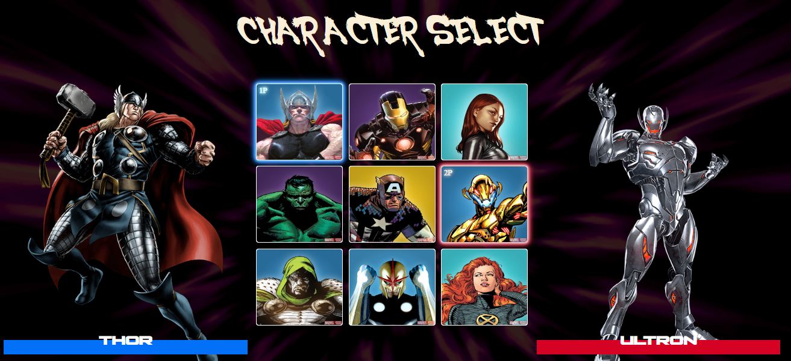

# Projeto Marvel

Esse projeto foi realizado durante uma semana de aprendizao intensivo de HTML, CSS e JavaScript, com a equipe Devemdobro.

## 🤖 Essa é uma prévia do projeto
  

## Clique no link para ver mais detalhes

  

# [🔗  Ver projeto](https://karoltoledo.github.io/Marvel/)    

# 🛠️ Tecnologias utilizadas 

 

